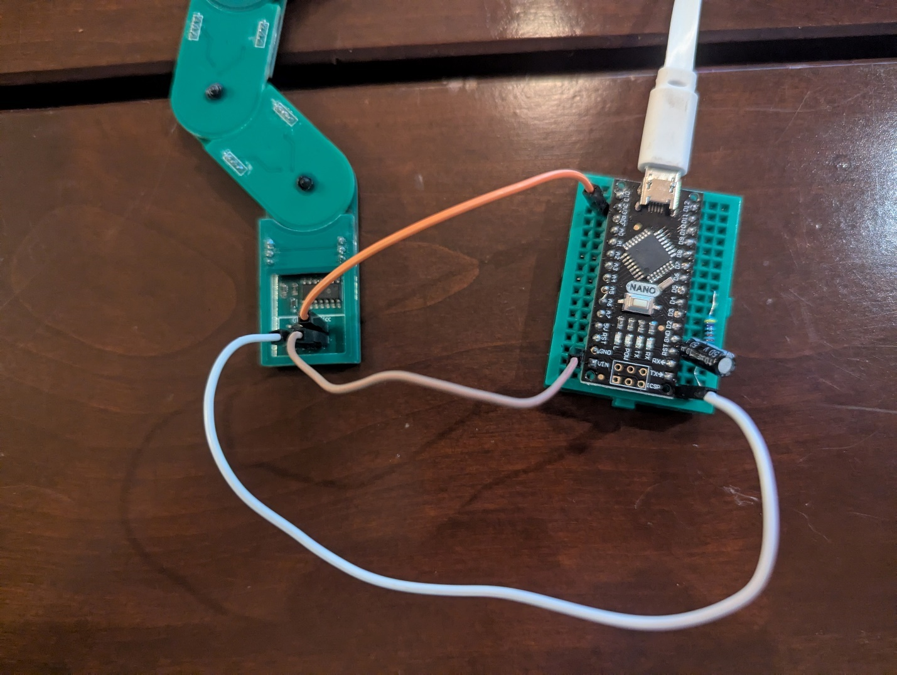

The bendy SAO contains an ATTiny 3224 which can be programed using any
UPDI programmer.

If you do not have an UPDI programmer, you can make one with an Arduino
Nano or Arduino Uno, by following the directions here:
<https://fabacademy.org/2021/labs/zoi/week8_emb_programming.html>

and flashing the Nano with the jtag2updi firmware found here:
<https://github.com/ElTangas/jtag2updi>\
\
Once the UPDI programmer is working, connect it to the SAO connector.
**The UPDI pin on the ATTiny is attached to GP1 on the SAO connector**,
while **Voltage/Ground connect to the corresponding pins on the
programmer/SAO.**

{width="6.5in" height="4.894444444444445in"}

To display blinky light patterns on the ATTiny, install the following
code using the UPDI programmer and the Arduino IDE.

<https://github.com/geekmomprojects/BendySAO/tree/main/SuperConEurope2025/programming/strandtest_wheel_for_bendy_sao>

The Arduino settings should match those shown below (use whatever COM
port is attached to the UPDI programmer)

{width="6.5in"
height="5.585416666666666in"}

If you encounter difficulties uploading the code, you may need to run
"Burn Bootloader" first.

Sadly, due to some design decisions I made, there isn't an easy way to
get the SAO to interact with the badge. Though it is connected to I2C, I
neglected to put pullup resistors on the ATTiny's SCL/SDA pins, so it
isn't actually possible to communicate with the ATTiny via I2C.

And, in a failed attempt to be able to use the Raspi Pico as a
programmer, GPIO1 and GPIO2 on the SAO connector are connected to an
UPDI programming circuit and can't be (easily) used directly as I/O for
the ATTiny 3224.

So please enjoy the SAO as a decorative, but not interactive art piece
to go with the badge. The design process has been a significant learning
experience for me.
