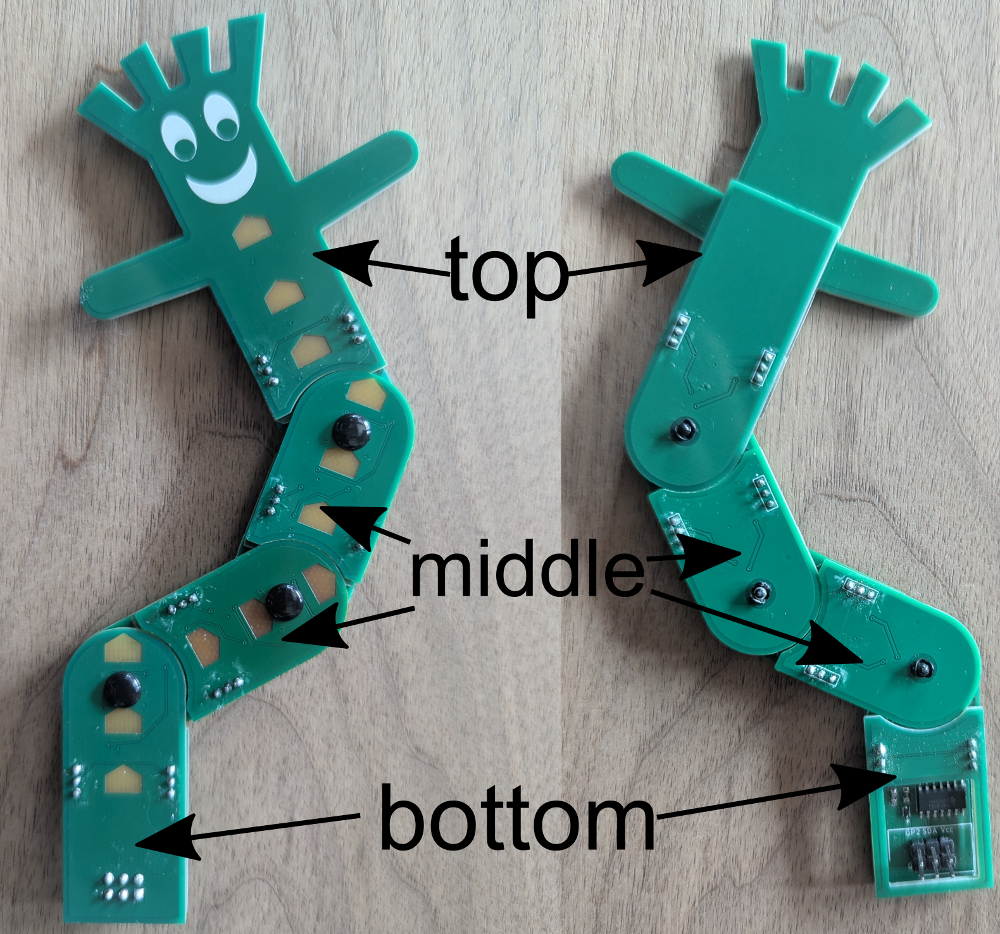

**IMPORTANT: Before starting assembly, please review all instructions to
make sure you understand the correct alignment and orientation of the
component parts. The arrangement of the pieces is NOT intuitive and must
be correct for the Bendy SAO to function correctly.**

# STEP 1: ASSEMBLE EACH SECTION

The exact number of components you receive will depend on whether your
Bendy SAO assembly consists of three or four (or more) sections. There
are three different types of sections in a Bendy SAO (top, middle, and
bottom). You can chain as many middle sections as desired together to
increase the SAO's length.

<figure>

<figcaption>
caption: The three different sections in a Bendy SAO. This SAO
has two identical middle sections.
</figcaption>
</figure>

Each section consists of a **(1) front PCB**, **(2) back PCB**, and
**(3) acrylic buffer layer**. The acrylic buffer layer sits between the
front and back PCBs. In each segment, the front and back PCBs are joined
by header pins which must be soldered on the OUTSIDE of the PCB assembly
so that the header pin insulation sits between the front and back PCBs.

Assemble and solder each section as shown below BEFORE combining the
sections into the final assembly. If there is protective paper on the
acrylic, remove it before placing the acrylic between the PCBs. **DO NOT
FORGET TO PLACE THE ACRYLIC BETWEEN THE PCBs BEFORE SOLDERING EACH
SECTION!**

### **Bottom Section:**

{width="2.5833333333333335in"
height="2.5in"} {width="2.2117727471566053in"
height="2.5in"}

### **Middle Section:**

**!!! It is essential that the alignment of the front and back PCBs in
the middle section matches the image below !!!**

{width="3.0032655293088366in"
height="2.5in"} {width="1.992671697287839in"
height="2.5in"}

### **Top Section:**

{width="2.2544586614173228in"
height="2.0in"} {width="1.3907764654418198in"
height="2.0in"}

The image below shows where to apply the solder when connecting the
front and back PCBs in each section. Be sure to solder the front and
back PCBs in each section together BEFORE connecting the sections
together in the final assembly.

{width="6.920599300087489in"
height="7.376334208223972in"}

# Step 2: Combine Sections into the Bendy SAO Assembly

Use the plastic push rivets to join the soldered sections together into
the final assembly. When joining two sections together, the spring
connectors in one section make contact with the ring pads on the
adjacent section. The acrylic buffer layer maintains the correct
separation between PCBs so that the spring connectors don't get crushed.

Unfortunately I don't have photos of this part, but it's easiest to
start by joining the bottom section to the middle section of the Bendy
SAO and follow the steps below:

(1) Hold the two sections together so that the spring contacts on the
    bottom section are facing the ring pads on the middle section.

(2) Align the holes of both sections together, then take a plastic push
    rivet, and insert it into the hole in the front PCB of the bottom
    section, and press until the tip of the rivet exits the hole in the
    back PCB of the middle section. You will probably hear a slight
    "pop" as the push rivet settles into place.

(3) If you can't apply enough pressure to fully insert the rivet with
    your fingers, then place the sections, joined by the rivet, onto a
    flat surface, with the rivet head facing the surface. Apply gentle
    pressure to the assembly until the rivet "pops" into place.

(4) Once inserted, the sections should pivot smoothly around the rivet
    while remaining attached to each other.

Repeat this process until all sections of the Bendy SAO are joined
together as shown below:

{width="7.117220034995626in"
height="8.177508748906387in"}
